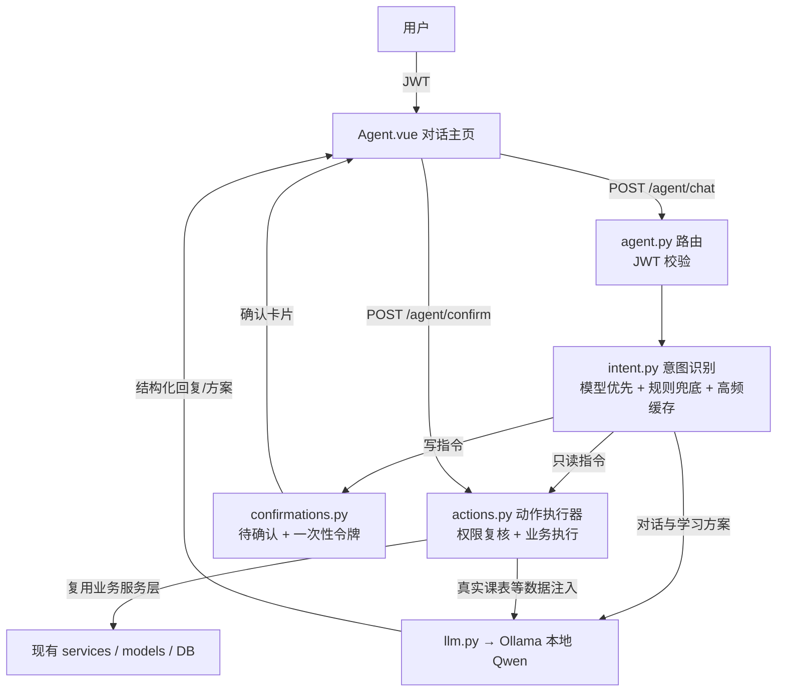

# AI 智能体助手（Agent 主页）设计文档

- 日期：2026-08-02
- 状态：已获用户确认，待用户审阅后进入实施计划
- 风险分类：标准任务（跨前端页面 / 后端服务 / 种子数据多个所有者，引入本地模型服务，全部复用现有认证与业务逻辑）

## 1. 背景与目标

在大学生管理系统中新增一个"智能体助手"主页：登录后的默认页面是一个对话窗口，用户用自然语言输入指令，智能体能够：

- 自动跳转到对应业务页面；
- 查询课表（如"明天上什么课"）；
- 根据明天的课表生成结构化学习方案；
- 执行写操作（选课、退课、教室预约、报修提交、请假提交），执行前必须由用户二次确认。

## 2. 已确认的产品决策

| 主题 | 决策 |
| --- | --- |
| 智能体大脑 | 本地 Ollama + Qwen 负责对话、学习方案生成与意图抽取；不接云端 API |
| 意图识别 | 本地模型优先（prompt 约束输出结构化 JSON），规则引擎仅作**意图识别兜底**，不直接执行业务操作 |
| 动作执行 | 由独立的**动作执行器**统一执行所有意图动作，执行前按当前用户身份做权限复核 |
| 可用性 | LLM 超时/宕机自动降级规则兜底，绝不阻塞；高频指令走缓存快速通道 |
| 多指令处理 | 一条消息可含多个意图，按顺序执行；只读立即出结果，写操作逐个出确认卡片；任一失败即停，已完成结果保留 |
| 权限模型 | 分级授权：只读自动执行，写操作先出确认卡片 |
| 主页位置 | 对话窗口为登录后默认主页，Dashboard 保留在侧边栏 |
| 结果展示 | 查询结果在对话内内联卡片/表格展示；仅明确"去 XX 页"指令才跳转 |
| 学习方案 | 结构化卡片：每门课建议时长、预习重点、复习要点、优先级、整体安排 |
| 测试账号 | 新增专用测试学生 `agent01`，课表覆盖一周每天，预留可选课程 |

## 3. 架构



关键澄清：

- **意图识别**（谁在理解用户想干什么）与**动作执行**（谁来真的干活）是两个独立模块。规则引擎只参与"理解"，永远不直接操作数据库或调用业务接口；
- LLM 的上下文来自**动作执行器拉取的真实数据**（见 6.4），模型本身不直接访问数据库。

### 3.1 新增文件

后端（`app/`）：

- `app/services/agent/__init__.py`：智能体服务包
- `app/services/agent/intent.py`：意图识别（LLM 优先 + 规则兜底）
- `app/services/agent/actions.py`：动作执行器（只读直跑，写操作产出待确认结果）
- `app/services/agent/llm.py`：Ollama 客户端（对话、意图抽取、学习方案生成，含超时与降级）
- `app/services/agent/confirmations.py`：一次性确认令牌管理（生成、校验、过期、防重放）
- `app/api/agent.py`：`POST /agent/chat`、`POST /agent/confirm`、`GET /agent/status`

前端（`student-management-frontend/src/`）：

- `views/Agent.vue`：对话主页（默认路由）
- `api/agent.js`：axios 封装
- 路由调整：`/` 默认指向 Agent，Dashboard 移至 `/dashboard`，侧边栏保留两个入口

配置：

- `.env` / `.env.example` 新增 `OLLAMA_BASE_URL`、`OLLAMA_MODEL`、`OLLAMA_TIMEOUT`、`AGENT_CONFIRM_TTL`

种子数据：

- `app/init_data.py` 新增 `agent01` 测试学生及全周课表、可选课程

## 4. 组件职责

| 组件 | 职责 | 依赖 |
| --- | --- | --- |
| `intent.py` | 先查高频指令缓存，未命中再调 LLM 抽取意图（JSON 校验，失败重试一次），LLM 不可用/超时退回关键词/正则；均失败返回引导回复 | `llm.py` |
| `actions.py` | 按意图调现有业务服务层；**执行前按当前用户身份做权限复核**（防越权）；写操作先预检（窗口/名额/冲突）再返回待确认结果 | 现有 services/models |
| `llm.py` | 调用 Ollama 的 `/api/chat`，`format: json` 用于意图抽取；离线/超时抛降级信号 | Ollama HTTP |
| `confirmations.py` | 待确认动作 + 一次性令牌（默认 5 分钟过期，确认后作废） | 内存存储 |
| `agent.py` | 路由层：校验 JWT，串起识别 → 执行 → 返回对话消息；`GET /agent/status` 供前端展示模型连接状态 | 以上三者 |
| `Agent.vue` | 消息流渲染、内联卡片/表格、确认/取消按钮、跳转指令 | 现有 store/api |

## 5. 意图协议

LLM 抽取与规则引擎输出统一的结构化意图，后端用 Pydantic 校验：

```json
{
  "intents": [
    { "intent": "enroll", "params": { "course": "高等数学" }, "confidence": 0.92, "need_confirm": true },
    { "intent": "query_schedule", "params": { "date": "tomorrow" }, "confidence": 0.90, "need_confirm": false },
    { "intent": "study_plan", "params": { "date": "tomorrow" }, "confidence": 0.85, "need_confirm": false }
  ]
}
```

- LLM 通道输出**有序意图列表**（`intents`），执行器按顺序处理；
- 规则引擎兜底时一条消息只输出一个意图；多个关键词同时命中时按预定义优先级取最高者，并在回复中提示"其余指令未处理，请拆开发送"；
- `need_confirm=true` 的意图（所有写操作）一律走确认卡片流程；只读意图直接执行。

## 6. 数据流

### 6.1 写操作（例：帮我选高等数学）

1. 用户发送消息 → `POST /agent/chat`；
2. 意图识别为 `enroll`（写操作）；
3. 动作执行器预检：选课窗口是否开放、名额、时间冲突 → 生成待确认结果；
4. 返回 `awaiting_confirmation` 消息 + 一次性令牌，前端渲染确认卡片；
5. 用户点"确认执行" → `POST /agent/confirm {token}`；
6. 服务端校验令牌（存在、未过期、未使用）后执行选课；
7. **执行结果（成功/失败 + 原因）作为系统消息回写对话流**，前端更新卡片状态并追加结果卡片；失败（满员/冲突/窗口关闭）保留原卡片并给出原因，可重试或修改。

### 6.2 只读操作（例：明天上什么课）

意图识别 → 直接查课表 → 返回内联表格卡片。

### 6.3 学习方案（例：给明天学习方案）

1. 意图识别为 `study_plan`；
2. 查当前学生明天的课表（课程、时间、地点、老师）；
3. 课表数据拼进 prompt 发给本地 Qwen，要求输出结构化方案（每门课建议时长、预习重点、复习要点、优先级、整体安排）；
4. Ollama 离线/超时 → 降级为模板方案并提示"本地模型未启动"。

### 6.4 上下文注入时机（"有数据支撑的 AI"）

LLM 本身不知道用户数据，所有需要数据支撑的生成（学习方案、选课建议等）都遵循**先取数、后生成**的顺序：

1. 意图识别为需要数据的意图；
2. 动作执行器用当前用户身份从数据库拉取真实数据（如明天课表、可选课程、余量）；
3. 数据按模板整理成 prompt 上下文（脱敏：不含密码/token，仅业务字段）；
4. 再调用 LLM 生成结构化回复/方案。

纯闲聊（不需要数据）直接走 LLM，不注入上下文。

### 6.5 多指令顺序执行（例：帮我选高数，然后查明天的课，再给学习方案）

1. 意图识别输出有序列表（选课 / 查课表 / 学习方案三个意图）；
2. 执行器按顺序逐个处理：选课（写）→ 出确认卡片；查课表（只读）→ 直接返回表格卡片；学习方案 → 拉数据调 LLM 返回方案卡片；
3. 写操作的确认卡片**逐个出现**，用户可逐个确认或跳过，每个写操作有独立的一次性令牌；
4. **任一意图失败即停**：后续意图不再执行，对话中报告失败意图与原因，已完成的意图结果保留在对话流中；
5. 全部处理完后追加一条汇总消息（共 N 个指令：成功 X、跳过 Y、失败 Z）。

## 7. 错误处理

- LLM 意图抽取超时（默认 10 秒）或不可用：直接启用规则兜底，绝不阻塞；高频指令命中缓存则跳过 LLM；
- 意图识别失败：对话内返回引导语 + 常用指令示例；
- 选课窗口关闭 / 满员 / 冲突：卡片说明原因；
- 确认令牌过期或已使用：提示重新发起，原令牌作废；
- Ollama 不可用：意图识别降级规则引擎，学习方案降级模板，对话回复基础提示；`GET /agent/status` 告知前端模型状态；
- 模型输出 JSON 不合法：重试一次，仍失败走规则兜底。
- 越权操作（如学生尝试执行管理员动作）：执行器权限复核拒绝，对话内返回"无权限"卡片。
- 多指令执行中某意图失败：停止后续意图，报告失败原因，已完成结果保留（§6.5）。

注：待确认令牌存于后端进程内存（v1 单进程运行），服务重启后未确认的请求失效，需用户重新发起；生产多 worker 部署时需改为共享存储（如 Redis），属后续增强。

## 8. 安全决策

- 智能体始终以当前登录用户身份执行，复用现有 JWT 与权限检查，无提权路径；
- **执行器二次权限复核**：不依赖入口 JWT，动作执行前按当前用户角色与资源归属校验（学生只能操作自己的选课/课表，教师只能操作自己有权限的资源），直接复用现有业务服务层内的权限逻辑，禁止绕过；
- 所有写操作必须经过一次性确认令牌（5 分钟有效，防重放）；
- 只读与写操作的边界在服务端强制执行，不依赖前端；
- 本地模型不接触数据库与 API，仅接收脱敏后的课表文本；
- Ollama 只监听 localhost（README 说明），生产部署时需独立评估。

## 8.1 评审意见与设计对策

| # | 评审风险点 | 设计对策 | 结论 |
| --- | --- | --- | --- |
| 1 | 执行器缺权限校验，可能越权 | 入口 JWT 之外，动作执行器再做一次按用户身份与资源归属的权限复核，复用现有业务层权限逻辑 | 已采纳（§8） |
| 2 | LLM 是单点，宕机/超时整个 Agent 不可用 | LLM 超时（10s）即降级规则兜底；高频指令缓存快速通道；`/agent/status` 状态提示 | 已采纳（§4、§7） |
| 3 | 正则规则库会越来越难维护 | v1 规则库小而结构化（按意图分组 + 分层匹配：精确短语 → 关键词 → 正则）；若指令超 50 条再评估轻量分类模型（如 BERT），作为 v1 后演进路径 | 部分采纳（v1 不引入新模型依赖） |
| 4 | 模型不知道用户课表，需要 RAG/上下文注入 | 采用"先取数、后生成"：执行器拉取真实数据注入 prompt，不做向量库检索（v1 数据量无需） | 已采纳（§6.4） |
| 5 | 确认执行后对话状态如何更新 | 执行结果作为系统消息回写对话流，前端追加结果卡片，失败可重试，保证闭环 | 已采纳（§6.1） |
| 6 | 一条消息含多个指令时无法全部执行 | 协议升级为有序意图列表，顺序执行；只读立即出结果，写操作逐个确认；任一失败即停并报告 | 已采纳（§5、§6.5） |

## 9. 测试策略

- 意图识别：规则引擎表驱动单元测试（每类指令多个说法）；LLM 通道在测试中全部 mock；
- 动作执行器：复用现有 sqlite 测试库，验证只读直接返回、写操作预检与拒绝路径；
- 接口测试：`/agent/chat` 只读路径、写操作待确认 → 确认 → 执行全流程、令牌过期/重复使用、未认证访问；
- 多指令：单元/接口测试覆盖顺序执行、写操作逐个确认、跳过、失败即停与部分结果保留；
- 种子数据测试：断言 `agent01` 一周每天都有课、存在可选课程；
- 真实 Ollama：实施完成后手动演示验证一次（对话、学习方案、选课全流程）；
- 前端：`npm run build` + 手动演示截图。

## 10. 非目标（v1 不做）

- 不做云端大模型接入；
- 不做聊天记录持久化（v1 为前端会话内内存）；
- 不把 Ollama 纳入 docker-compose（v1 跑宿主机）；
- 支持一条消息内多意图**顺序**执行，但不做意图间**依赖编排**（如"先查课表再据此排计划"）与多轮任务状态机；
- 不引入 BERT/轻量分类模型（v1 规则库规模可控，膨胀后作为演进路径）；
- 不做向量库 RAG（v1 采用"先取数、后生成"注入即可）；
- 不做语音、图片输入。

## 11. 验收标准

- 登录后默认进入 Agent 对话主页；
- `agent01` 可查询明天的课，可生成学习方案，可完成一次带确认的选课；
- 一条消息含多个指令时按顺序执行：写操作逐个确认、任一失败即停且已完成结果保留；
- Ollama 关闭时核心只读指令与规则兜底仍可用；
- 越权操作被执行器拒绝并在对话中提示；
- 确认执行后对话流展示执行结果（成功/失败）；
- 全部单元/接口测试通过，前端构建通过。
