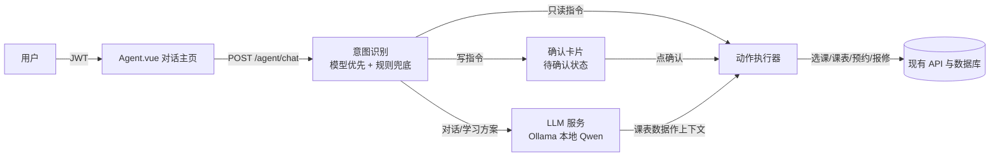

# AI 智能体助手（Agent 主页）设计文档

- 日期：2026-08-02
- 状态：已获用户确认，待用户审阅后进入实施计划
- 风险分类：标准任务（跨前端页面 / 后端服务 / 种子数据多个所有者，引入本地模型服务，全部复用现有认证与业务逻辑）

## 1. 背景与目标

在大学生管理系统中新增一个"智能体助手"主页：登录后的默认页面是一个对话窗口，用户用自然语言输入指令，智能体能够：

- 自动跳转到对应业务页面；
- 查询课表（如"明天上什么课"）；
- 根据明天的课表生成结构化学习方案；
- 执行写操作（选课、退课、教室预约、报修提交、请假提交），执行前必须由用户二次确认。

## 2. 已确认的产品决策

| 主题 | 决策 |
| --- | --- |
| 智能体大脑 | 规则引擎负责动作执行；对话与学习方案由本地 Ollama + Qwen 生成；不接云端 API |
| 意图识别 | 本地模型优先（prompt 约束输出结构化 JSON），规则引擎兜底 |
| 权限模型 | 分级授权：只读自动执行，写操作先出确认卡片 |
| 主页位置 | 对话窗口为登录后默认主页，Dashboard 保留在侧边栏 |
| 结果展示 | 查询结果在对话内内联卡片/表格展示；仅明确"去 XX 页"指令才跳转 |
| 学习方案 | 结构化卡片：每门课建议时长、预习重点、复习要点、优先级、整体安排 |
| 测试账号 | 新增专用测试学生 `agent01`，课表覆盖一周每天，预留可选课程 |

## 3. 架构



### 3.1 新增文件

后端（`app/`）：

- `app/services/agent/__init__.py`：智能体服务包
- `app/services/agent/intent.py`：意图识别（LLM 优先 + 规则兜底）
- `app/services/agent/actions.py`：动作执行器（只读直跑，写操作产出待确认结果）
- `app/services/agent/llm.py`：Ollama 客户端（对话、意图抽取、学习方案生成，含超时与降级）
- `app/services/agent/confirmations.py`：一次性确认令牌管理（生成、校验、过期、防重放）
- `app/api/agent.py`：`POST /agent/chat`、`POST /agent/confirm`、`GET /agent/status`

前端（`student-management-frontend/src/`）：

- `views/Agent.vue`：对话主页（默认路由）
- `api/agent.js`：axios 封装
- 路由调整：`/` 默认指向 Agent，Dashboard 移至 `/dashboard`，侧边栏保留两个入口

配置：

- `.env` / `.env.example` 新增 `OLLAMA_BASE_URL`、`OLLAMA_MODEL`、`OLLAMA_TIMEOUT`、`AGENT_CONFIRM_TTL`

种子数据：

- `app/init_data.py` 新增 `agent01` 测试学生及全周课表、可选课程

## 4. 组件职责

| 组件 | 职责 | 依赖 |
| --- | --- | --- |
| `intent.py` | 先调 LLM 抽取意图（JSON 校验，失败重试一次），再退回关键词/正则；两者均失败返回引导回复 | `llm.py` |
| `actions.py` | 按意图调现有业务逻辑；写操作先预检（窗口/名额/冲突）再返回待确认结果 | 现有 services/models |
| `llm.py` | 调用 Ollama 的 `/api/chat`，`format: json` 用于意图抽取；离线/超时抛降级信号 | Ollama HTTP |
| `confirmations.py` | 待确认动作 + 一次性令牌（默认 5 分钟过期，确认后作废） | 内存存储 |
| `agent.py` | 路由层：校验 JWT，串起识别 → 执行 → 返回对话消息；`GET /agent/status` 供前端展示模型连接状态 | 以上三者 |
| `Agent.vue` | 消息流渲染、内联卡片/表格、确认/取消按钮、跳转指令 | 现有 store/api |

## 5. 意图协议

LLM 抽取与规则引擎输出统一的结构化意图，后端用 Pydantic 校验：

```json
{
  "intent": "enroll | drop | query_schedule | study_plan | query_classroom | reserve_classroom | repair_submit | leave_apply | navigate | chat",
  "params": {
    "course": "高等数学",
    "page": "/selection"
  },
  "confidence": 0.92,
  "need_confirm": true
}
```

`need_confirm=true` 的意图（所有写操作）一律走确认卡片流程；只读意图直接执行。

## 6. 数据流

### 6.1 写操作（例：帮我选高等数学）

1. 用户发送消息 → `POST /agent/chat`；
2. 意图识别为 `enroll`（写操作）；
3. 动作执行器预检：选课窗口是否开放、名额、时间冲突 → 生成待确认结果；
4. 返回 `awaiting_confirmation` 消息 + 一次性令牌，前端渲染确认卡片；
5. 用户点"确认执行" → `POST /agent/confirm {token}`；
6. 服务端校验令牌（存在、未过期、未使用）后执行选课，返回成功卡片；
7. 失败（满员/冲突/窗口关闭）返回原因卡片。

### 6.2 只读操作（例：明天上什么课）

意图识别 → 直接查课表 → 返回内联表格卡片。

### 6.3 学习方案（例：给明天学习方案）

1. 意图识别为 `study_plan`；
2. 查当前学生明天的课表（课程、时间、地点、老师）；
3. 课表数据拼进 prompt 发给本地 Qwen，要求输出结构化方案（每门课建议时长、预习重点、复习要点、优先级、整体安排）；
4. Ollama 离线/超时 → 降级为模板方案并提示"本地模型未启动"。

## 7. 错误处理

- 意图识别失败：对话内返回引导语 + 常用指令示例；
- 选课窗口关闭 / 满员 / 冲突：卡片说明原因；
- 确认令牌过期或已使用：提示重新发起，原令牌作废；
- Ollama 不可用：意图识别降级规则引擎，学习方案降级模板，对话回复基础提示；
- 模型输出 JSON 不合法：重试一次，仍失败走规则兜底。

注：待确认令牌存于后端进程内存（v1 单进程运行），服务重启后未确认的请求失效，需用户重新发起；生产多 worker 部署时需改为共享存储（如 Redis），属后续增强。

## 8. 安全决策

- 智能体始终以当前登录用户身份执行，复用现有 JWT 与权限检查，无提权路径；
- 所有写操作必须经过一次性确认令牌（5 分钟有效，防重放）；
- 只读与写操作的边界在服务端强制执行，不依赖前端；
- 本地模型不接触数据库与 API，仅接收脱敏后的课表文本；
- Ollama 只监听 localhost（README 说明），生产部署时需独立评估。

## 9. 测试策略

- 意图识别：规则引擎表驱动单元测试（每类指令多个说法）；LLM 通道在测试中全部 mock；
- 动作执行器：复用现有 sqlite 测试库，验证只读直接返回、写操作预检与拒绝路径；
- 接口测试：`/agent/chat` 只读路径、写操作待确认 → 确认 → 执行全流程、令牌过期/重复使用、未认证访问；
- 种子数据测试：断言 `agent01` 一周每天都有课、存在可选课程；
- 真实 Ollama：实施完成后手动演示验证一次（对话、学习方案、选课全流程）；
- 前端：`npm run build` + 手动演示截图。

## 10. 非目标（v1 不做）

- 不做云端大模型接入；
- 不做聊天记录持久化（v1 为前端会话内内存）；
- 不把 Ollama 纳入 docker-compose（v1 跑宿主机）；
- 不做多轮复杂任务编排（如"连续做三件事"）；一次对话一个意图；
- 不做语音、图片输入。

## 11. 验收标准

- 登录后默认进入 Agent 对话主页；
- `agent01` 可查询明天的课，可生成学习方案，可完成一次带确认的选课；
- Ollama 关闭时核心只读指令与规则兜底仍可用；
- 全部单元/接口测试通过，前端构建通过。
