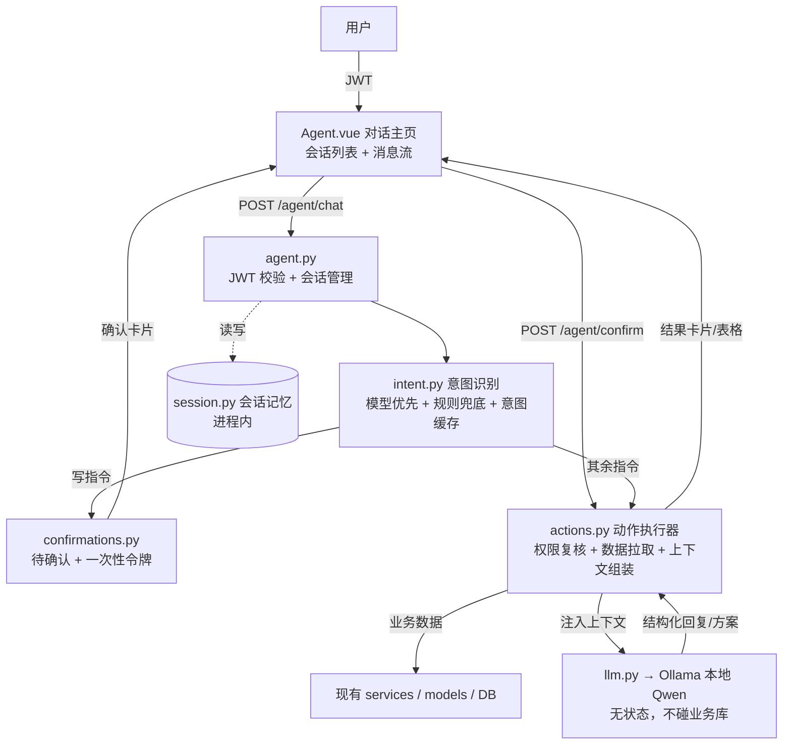
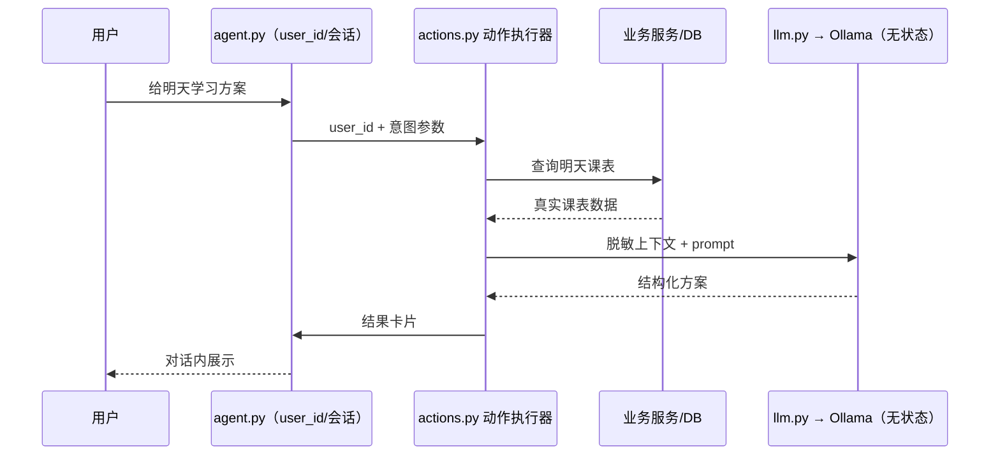

# AI 智能体助手（Agent 主页）设计文档

- 日期：2026-08-02
- 状态：已获用户确认，待用户审阅后进入实施计划
- 风险分类：标准任务（跨前端页面 / 后端服务 / 种子数据多个所有者，引入本地模型服务，全部复用现有认证与业务逻辑）

## 1. 背景与目标

在大学生管理系统中新增一个"智能体助手"主页：登录后的默认页面是一个对话窗口，用户用自然语言输入指令，智能体能够：

- 自动跳转到对应业务页面；
- 查询课表（如"明天上什么课"）；
- 根据明天的课表生成结构化学习方案；
- 执行写操作（选课、退课、教室预约、报修提交、请假提交），执行前必须由用户二次确认。

## 2. 已确认的产品决策

| 主题 | 决策 |
| --- | --- |
| 智能体大脑 | 本地 Ollama + Qwen 负责对话、学习方案生成与意图抽取；不接云端 API |
| 意图识别 | 本地模型优先（prompt 约束输出结构化 JSON），规则引擎仅作**意图识别兜底**，不直接执行业务操作 |
| 动作执行 | 由独立的**动作执行器**统一执行所有意图动作，执行前按当前用户身份做权限复核 |
| 可用性 | LLM 超时/宕机自动降级规则兜底，绝不阻塞；高频指令走缓存快速通道 |
| 多指令处理 | 一条消息可含多个意图，按顺序执行；只读立即出结果，写操作逐个出确认卡片；业务失败跳过该意图继续后续，系统异常才中断全部 |
| 权限模型 | 分级授权：只读自动执行，写操作先出确认卡片 |
| 主页位置 | 对话窗口为登录后默认主页，Dashboard 保留在侧边栏 |
| 结果展示 | 查询结果在对话内内联卡片/表格展示；仅明确"去 XX 页"指令才跳转 |
| 学习方案 | 结构化卡片：每门课建议时长、预习重点、复习要点、优先级、整体安排 |
| 测试账号 | 新增专用测试学生 `agent01`：课表覆盖一周每天；可选课程余量 > 0、选课窗口开放、与课表无时间冲突（首次选课预检必过） |

## 3. 架构



关键澄清：

- **意图识别**（谁在理解用户想干什么）与**动作执行**（谁来真的干活）是两个独立模块。规则引擎只参与"理解"，永远不直接操作数据库或调用业务接口；
- **只有动作执行器能访问业务库**；LLM 的上下文由动作执行器拉取真实数据后注入（见 6.4），`llm.py` 无状态、不直接访问数据库、不感知"当前是谁在问"；
- 用户身份与意图参数由 `agent.py` 传给 `actions.py`，对话历史由 `agent.py` 经 `session.py` 维护（见 6.6）。

### 3.1 新增文件

后端（`app/`）：

- `app/services/agent/__init__.py`：智能体服务包
- `app/services/agent/intent.py`：意图识别（LLM 优先 + 规则兜底）
- `app/services/agent/actions.py`：动作执行器（只读直跑，写操作产出待确认结果）
- `app/services/agent/llm.py`：Ollama 客户端（对话、意图抽取、学习方案生成，含超时与降级）
- `app/services/agent/confirmations.py`：一次性确认令牌管理（生成、校验、过期、防重放）
- `app/services/agent/session.py`：会话记忆（进程内，滑动窗口 + 事实表，TTL 过期）
- `app/api/agent.py`：`POST /agent/chat`、`POST /agent/confirm`、`GET /agent/status`、`GET /agent/sessions`、`DELETE /agent/sessions/{id}`

前端（`student-management-frontend/src/`）：

- `views/Agent.vue`：对话主页（默认路由，含会话列表 / 新建 / 删除）
- `api/agent.js`：axios 封装
- 路由调整：`/` 默认指向 Agent，Dashboard 移至 `/dashboard`，侧边栏保留两个入口

配置：

- `.env` / `.env.example` 新增 `OLLAMA_BASE_URL`、`OLLAMA_MODEL`、`OLLAMA_TIMEOUT`、`AGENT_CONFIRM_TTL`

种子数据：

- `app/init_data.py` 新增 `agent01` 测试学生及全周课表、可选课程

## 4. 组件职责

| 组件 | 职责 | 依赖 |
| --- | --- | --- |
| `intent.py` | 先查**意图识别缓存**（仅缓存识别结果，短 TTL，不缓存业务查询），未命中再调 LLM 抽取意图（JSON 校验，失败重试一次），LLM 不可用/超时退回关键词/正则（v1）；预留 BERT 语义兜底接口（v1.1） | `llm.py` |
| `actions.py` | 按意图调现有业务服务层；**执行前按当前用户身份做权限复核**（防越权）；负责**数据拉取与 LLM 上下文组装**；写操作先预检（窗口/名额/冲突）再返回待确认结果，成功后更新会话事实表 | 现有 services/models、`llm.py`、`session.py` |
| `llm.py` | 无状态，不直接访问业务库；调用 Ollama `/api/chat`（`format: json` 用于意图抽取）；含超时（10s）、并发上限（asyncio 信号量默认 4，排队超时返回繁忙）、连续失败熔断与降级信号 | Ollama HTTP |
| `confirmations.py` | 待确认动作 + 一次性令牌（默认 5 分钟过期，确认后作废） | 内存存储 |
| `session.py` | 按用户维护会话历史（滑动窗口）与事实表；提供压缩后的 LLM 上下文；TTL 过期清理 | 内存存储 |
| `agent.py` | 路由层：校验 JWT，维护会话读写，串起识别 → 执行 → 返回对话消息；`GET /agent/status` 供前端展示模型连接状态 | 以上四者 |
| `Agent.vue` | 消息流渲染、内联卡片/表格、确认/取消按钮、跳转指令 | 现有 store/api |

## 5. 意图协议

LLM 抽取与规则引擎输出统一的结构化意图，后端用 Pydantic 校验：

```json
{
  "intents": [
    { "intent": "enroll", "params": { "course": "高等数学" }, "confidence": 0.92, "need_confirm": true },
    { "intent": "query_schedule", "params": { "date": "tomorrow" }, "confidence": 0.90, "need_confirm": false },
    { "intent": "study_plan", "params": { "date": "tomorrow" }, "confidence": 0.85, "need_confirm": false }
  ]
}
```

- LLM 通道输出**有序意图列表**（`intents`），执行器按顺序处理；
- 规则引擎兜底时一条消息只输出一个意图；多个关键词同时命中时按预定义优先级取最高者，并在回复中提示"其余指令未处理，请拆开发送"；
- `need_confirm=true` 的意图（所有写操作）一律走确认卡片流程；只读意图直接执行。

## 6. 数据流

### 6.1 写操作（例：帮我选高等数学）

1. 用户发送消息 → `POST /agent/chat`；
2. 意图识别为 `enroll`（写操作）；
3. 动作执行器预检：选课窗口是否开放、名额、时间冲突 → 生成待确认结果；
4. 返回 `awaiting_confirmation` 消息 + 一次性令牌，前端渲染确认卡片；
5. 用户点"确认执行" → `POST /agent/confirm {token}`；
6. 服务端校验令牌（存在、未过期、未使用）后执行选课；
7. **执行结果（成功/失败 + 原因）作为系统消息回写对话流**，前端更新卡片状态并追加结果卡片；失败（满员/冲突/窗口关闭）保留原卡片并给出原因，可重试或修改。

### 6.2 只读操作（例：明天上什么课）

意图识别 → 直接查课表 → 返回内联表格卡片。

### 6.3 学习方案（例：给明天学习方案）

1. 意图识别为 `study_plan`；
2. 查当前学生明天的课表（课程、时间、地点、老师）；
3. 课表数据拼进 prompt 发给本地 Qwen，要求输出结构化方案（每门课建议时长、预习重点、复习要点、优先级、整体安排）；
4. Ollama 离线/超时 → 降级为模板方案并提示"本地模型未启动"。

### 6.4 上下文注入时机（"有数据支撑的 AI"）

数据流方向：**只有动作执行器能访问业务库**；`llm.py` 无状态、不直接访问数据库、不感知"当前是谁在问"。用户身份与意图参数由 `agent.py` 传入 `actions.py`，数据拉取与 prompt 上下文组装全部在 `actions.py` 完成。



1. 意图识别为需要数据的意图；
2. `actions.py` 用当前用户身份从数据库拉取真实数据（如明天课表、可选课程、余量）；
3. 数据按模板整理成 prompt 上下文（脱敏：不含密码/token，仅业务字段）；
4. `actions.py` 调用 `llm.py` 生成结构化回复/方案并返回。

纯闲聊（不需要数据）由 `actions.py` 直接转发给 `llm.py`，不注入上下文。

### 6.5 多指令顺序执行（例：帮我选高数，然后查明天的课，再给学习方案）

1. 意图识别输出有序列表（选课 / 查课表 / 学习方案三个意图）；
2. 执行器按顺序逐个处理：选课（写）→ 出确认卡片；查课表（只读）→ 直接返回表格卡片；学习方案 → 拉数据调 LLM 返回方案卡片；
3. 写操作的确认卡片**逐个出现**，用户可逐个确认或跳过，每个写操作有独立的一次性令牌；
4. **失败分级处理**：
   - **预检/业务失败**（满员、时间冲突、窗口关闭、无权限）：报告原因，**跳过该意图并继续执行后续意图**（只读意图照常执行；后续写操作继续独立预检出卡片）；若后续意图明确引用了失败意图的输出，则标记"因前置失败跳过"；
   - **系统异常**（数据库连接断开、服务内部错误）：**立即停止**所有后续意图，报告"系统异常，请稍后重试"；
5. 全部处理完后追加一条汇总消息（共 N 个指令：成功 X、业务失败 Y、跳过 W、系统中断 Z）。

### 6.6 会话记忆与多窗口（记忆能力）

Ollama 无状态，智能体的"记忆"由后端 `session.py` 维护（v1 进程内，不持久化）。

**多窗口（新开对话）**：

- 每个会话有独立 `session_id`（UUID），归属当前用户；前端提供"新建对话 / 会话列表 / 删除会话"；
- `POST /agent/chat` 携带 `session_id`（缺省则新建并返回新 id）；新增 `GET /agent/sessions`（列表）与 `DELETE /agent/sessions/{id}`；
- **每个窗口记忆独立**：事实表与会话历史都按 session 隔离，"刚才选的课"只指当前窗口内发生的动作；新窗口从空白开始；
- 每用户会话上限 20 个（内存 LRU，超出淘汰最旧）；30 分钟无活动清空；服务重启即丢失（v1 不持久化）。

**单窗口上下文长度约束**：

- 设定上下文预算 `CONTEXT_BUDGET_TOKENS`（默认 8000，远低于 Qwen2.5-7B 的 32k 窗口，留足余量）；
- 发送给 LLM 前按**优先级**组装，超出预算从低优先级开始裁：
  1. 系统 prompt + 意图/动作 schema（固定，必保留）；
  2. 当前用户消息 + 抽取出的意图参数（必保留）；
  3. 事实表（压缩为一行一条，最多占用预算 20%）；
  4. 最近消息窗口（从最旧开始丢弃）；
- 简易 token 估算：中文字符 × 0.7 + 英文/数字单词数，向上取整；发送前二次校验，仍超预算则进一步裁剪至"系统 + 当前消息 + 事实表"；
- v1 不做 LLM 摘要压缩（直接丢弃最旧 + 保留事实表）；事实表膨胀时，v1.2 再引入摘要任务。

## 7. 错误处理

- LLM 意图抽取超时（默认 10 秒）或不可用：直接启用规则兜底，绝不阻塞；高频指令命中缓存则跳过 LLM；
- 意图识别失败：对话内返回引导语 + 常用指令示例；
- 选课窗口关闭 / 满员 / 冲突：卡片说明原因；
- 确认令牌过期或已使用：提示重新发起，原令牌作废；
- Ollama 不可用：意图识别降级规则引擎，学习方案降级模板，对话回复基础提示；`GET /agent/status` 告知前端模型状态；
- 模型输出 JSON 不合法：重试一次，仍失败走规则兜底。
- 越权操作（如学生尝试执行管理员动作）：执行器权限复核拒绝，对话内返回"无权限"卡片。
- 多指令执行中某意图失败：停止后续意图，报告失败原因，已完成结果保留（§6.5）。
- LLM 并发达到上限或连续失败触发熔断（默认连续 3 次失败熔断 60 秒）：期间跳过 LLM，规则兜底处理确定指令，对话类返回"大模型服务暂时繁忙，请稍后重试或使用快捷指令"，页面不卡死；
- Ollama 部署调优：设置 `OLLAMA_NUM_PARALLEL`（与 llm.py 并发上限匹配）、`--num-ctx 8192`、`--num-batch 512`，避免推理队列积压冲垮服务；llm.py 外层用 asyncio 信号量限制并发（默认 4），排队等待超 15s 返回繁忙卡片；
- 缓存策略：缓存仅作用于**意图识别结果**（短 TTL）；业务查询（课表/成绩/选课状态）一律实时查库不缓存；写操作成功后更新会话事实表并让前端刷新相关页面数据，不存在脏缓存。
- 会话不存在或不属于当前用户：返回错误卡片，前端引导新建对话；
- 上下文超预算：自动按优先级裁剪最旧消息后正常处理，不报错（§6.6）。

注：待确认令牌存于后端进程内存（v1 单进程运行），服务重启后未确认的请求失效，需用户重新发起；生产多 worker 部署时需改为共享存储（如 Redis），属后续增强。

## 8. 安全决策

- 智能体始终以当前登录用户身份执行，复用现有 JWT 与权限检查，无提权路径；
- **执行器二次权限复核**：不依赖入口 JWT，动作执行前按当前用户角色与资源归属校验（学生只能操作自己的选课/课表，教师只能操作自己有权限的资源），直接复用现有业务服务层内的权限逻辑，禁止绕过；
- 所有写操作必须经过一次性确认令牌（5 分钟有效，防重放）；
- 只读与写操作的边界在服务端强制执行，不依赖前端；
- 本地模型不接触数据库与 API，仅接收脱敏后的课表文本；
- **会话隔离**：`session_id` 必须属于当前用户，禁止跨用户读取/操作他人会话；
- Ollama 只监听 localhost（README 说明），生产部署时需独立评估。

## 8.1 评审意见与设计对策

| # | 评审风险点 | 设计对策 | 结论 |
| --- | --- | --- | --- |
| 1 | 执行器缺权限校验，可能越权 | 入口 JWT 之外，动作执行器再做一次按用户身份与资源归属的权限复核，复用现有业务层权限逻辑 | 已采纳（§8） |
| 2 | LLM 是单点，宕机/超时整个 Agent 不可用 | LLM 超时（10s）即降级规则兜底；高频指令缓存快速通道；`/agent/status` 状态提示 | 已采纳（§4、§7） |
| 3 | 正则规则库会越来越难维护 | 现状核实：本机 HF 缓存仅有 `shibing624/bert4ner-base-chinese`（NER 模型，非意图分类器），项目 venv 未装 torch/transformers。决策：v1 规则库小而结构化（按意图分组 + 分层匹配），并**预留 BERT 语义兜底接口**；v1.1 安装 transformers + 中文句向量模型（如 text2vec-base-chinese）做意图模板相似度匹配，规则保留为最终兜底 | 部分采纳（v1 规则兜底；v1.1 BERT 语义兜底） |
| 4 | 模型不知道用户课表，需要 RAG/上下文注入 | 采用"先取数、后生成"：执行器拉取真实数据注入 prompt，不做向量库检索（v1 数据量无需） | 已采纳（§6.4） |
| 5 | 确认执行后对话状态如何更新 | 执行结果作为系统消息回写对话流，前端追加结果卡片，失败可重试，保证闭环 | 已采纳（§6.1） |
| 6 | 一条消息含多个指令时无法全部执行 | 协议升级为有序意图列表，顺序执行；只读立即出结果，写操作逐个确认；任一失败即停并报告 | 已采纳（§5、§6.5） |
| 7 | llm.py 与 actions.py 的数据流向不清晰 | 明确"只有动作执行器访问业务库"；llm.py 无状态不碰 DB；身份与参数由 agent.py 传入，数据拉取与上下文组装在 actions.py，配时序图 | 已采纳（§6.4） |
| 8 | Ollama 无状态，缺少记忆能力 | 新增 session.py：按用户维护滑动窗口历史 + 事实表，LLM 只取压缩后的窗口与事实，TTL 30 分钟 | 已采纳（§6.6） |
| 9 | 只读缓存可能返回脏数据 | 缓存仅限意图识别结果（短 TTL）；业务查询一律实时查库；写操作成功后更新事实表并刷新前端相关数据 | 已采纳（§7） |
| 10 | LLM 宕机/并发打满时页面卡死 | llm.py 加超时（10s）、并发上限、连续失败熔断（3 次/60s）；繁忙时明确提示并走规则兜底，前端有请求超时与忙碌态 | 已采纳（§4、§7） |
| 11 | 能否新开对话窗口 | 支持多会话：session_id 隔离，前端会话列表 + 新建/删除；每用户上限 20，LRU 淘汰 | 已采纳（§6.6） |
| 12 | 单窗口上下文长度约束 | 预算制：默认 8k token，按优先级组装（系统/当前消息/事实表/历史），从最旧裁剪，发送前二次校验 | 已采纳（§6.6） |
| 13 | Ollama 单卡并发有限，多请求会积压 | llm.py 外层 asyncio 信号量（默认 4）+ 排队超时繁忙提示；Ollama 部署调优 num-ctx=8192、num-batch=512、num-parallel 匹配 | 已采纳（§4、§7） |
| 14 | "任一失败即停"边界不清 | 区分业务失败（报告原因，跳过该意图，继续执行独立后续意图）与系统异常（中断全部）；引用失败结果的意图标记跳过 | 已采纳（§6.5） |
| 15 | 测试数据粒度不足，首次联调易踩业务冲突 | agent01 种子数据保证：可选课程余量>0、选课窗口开放、与课表无时间冲突，预检必过；Redis 队列/分布式锁作为访问量增长后的演进路径（v1 单进程 + DB 原子锁/唯一索引已覆盖） | 已采纳（§2、§10） |

## 9. 测试策略

- 意图识别：规则引擎表驱动单元测试（每类指令多个说法）；LLM 通道在测试中全部 mock；
- 动作执行器：复用现有 sqlite 测试库，验证只读直接返回、写操作预检与拒绝路径；
- 接口测试：`/agent/chat` 只读路径、写操作待确认 → 确认 → 执行全流程、令牌过期/重复使用、未认证访问；
- 多指令：单元/接口测试覆盖顺序执行、写操作逐个确认、跳过、失败即停与部分结果保留；
- 会话记忆：滑动窗口裁剪、事实表更新（选课/退课后能回答"刚才选的课"）、TTL 清空；
- 熔断与并发：连续失败熔断生效、并发上限拒绝时返回繁忙提示并走规则兜底；
- 会话：新建/切换/删除、跨用户隔离、上限 LRU 淘汰；
- 上下文预算：超预算裁剪后仍正常生成、事实表保留；
- 失败分级：业务失败后只读意图继续执行、系统异常中断全部、引用失败结果的意图被跳过；
- agent01 种子数据断言：可选课程余量 > 0、窗口开放、与课表无冲突（首次选课预检必过）；
- 种子数据测试：断言 `agent01` 一周每天都有课、存在可选课程；
- 真实 Ollama：实施完成后手动演示验证一次（对话、学习方案、选课全流程）；
- 前端：`npm run build` + 手动演示截图。

## 10. 非目标（v1 不做）

- 不做云端大模型接入；
- 不做聊天记录持久化到数据库（v1 会话记忆为后端进程内内存，重启丢失）；
- 不做跨会话长期记忆（用户下次登录不保留上次对话）；
- 不做跨窗口共享记忆（每个窗口独立，事实表不互通）；
- 不做 LLM 摘要压缩（v1 直接丢弃最旧消息 + 保留事实表，v1.2 可选）；
- 不引入 Redis 队列/分布式锁（v1 单进程 + 数据库原子锁/唯一索引已覆盖并发；访问量增长后作为演进路径评估）；
- 不把 Ollama 纳入 docker-compose（v1 跑宿主机）；
- 支持一条消息内多意图**顺序**执行，但不做意图间**依赖编排**（如"先查课表再据此排计划"）与多轮任务状态机；
- v1 不引入 BERT 分类器：规则库规模可控；本机现有 `bert4ner` 为 NER 模型不适用，且 venv 未装 transformers/torch。预留语义兜底接口，v1.1 升级为句向量相似度匹配（需联网下载模型 + 安装依赖）；
- 不做向量库 RAG（v1 采用"先取数、后生成"注入即可）；
- 不做语音、图片输入。

## 11. 验收标准

- 登录后默认进入 Agent 对话主页；
- `agent01` 可查询明天的课，可生成学习方案，可完成一次带确认的选课；
- 一条消息含多个指令时按顺序执行：写操作逐个确认、业务失败跳过、系统异常即停且已完成结果保留；
- Ollama 关闭时核心只读指令与规则兜底仍可用；
- Ollama 繁忙/宕机时页面不卡死，明确提示且规则兜底可用；
- 连续对话中能引用此前动作（如"退掉刚才选的课"）；
- 可新建/切换/删除会话窗口，各窗口记忆互不干扰；
- 单窗口上下文超预算时自动裁剪最旧消息，仍能正常回复；
- 选课业务失败（满员等）后，同一消息中的只读指令仍能继续执行；
- `agent01` 首次选课预检全部通过（余量 / 窗口 / 无冲突）；
- 越权操作被执行器拒绝并在对话中提示；
- 确认执行后对话流展示执行结果（成功/失败）；
- 全部单元/接口测试通过，前端构建通过。
